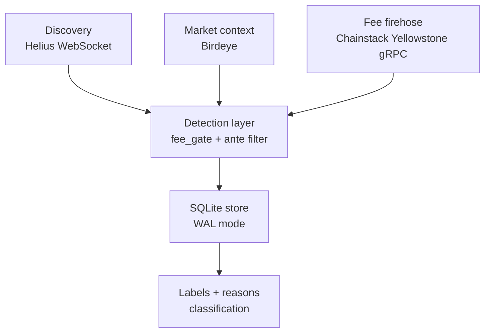

<p align="center">
  
</p>

# 🔥 Phoenix Bot (PHX1)

**An anti-manipulation research system for Solana token markets.**

Phoenix reads live on-chain activity, measures where the money is *actually* going, and labels what a market is doing — organic demand, wash trading, or coordinated extraction — before a person ever risks capital in it. This repository is the public research build of an ongoing project.

---

## Why this exists (please read this first)

If you don't follow crypto, the phrase "memecoin bot" probably sounds like exactly the kind of thing that should be viewed with suspicion. That reaction is fair, and it's most of the reason I built this.

New tokens launch on Solana constantly. The overwhelming majority are designed to extract money from newcomers: insiders manufacture the appearance of demand — fake volume, self-dealing trades, engineered fee structures — so that a person watching a chart *feels* like they're seeing a real, rising market when they are actually watching a machine set up to take from them. The retail participant almost never has the information needed to tell the difference, and by the time the pattern is obvious, the money is gone.

Two things bothered me about that:

1. **The information asymmetry is the whole scam.** Insiders can see the manipulation in the on-chain data; the person on the other side of the trade cannot. That gap is not a law of nature — it's just tooling that hasn't been built for the retail side.
2. **The environment is engineered to make people trade on emotion.** Fear and greed are the product. FOMO, panic, "it's still going up" — the design goal of a manufactured market is to override a person's judgment.

So Phoenix is not a tool for *finding things to buy*. It's a tool for **detecting manipulation, reducing that information gap, and taking the emotional operator out of the loop.** It answers a narrower, more honest question than "will this go up?" — it answers *"is what I'm looking at real, and what am I actually walking into?"*

I'd rather build the defensive instrument than another extraction tool. This is that instrument.

---

## What it actually does

Phoenix is built on one core idea: **manipulation is expensive to fake in the right data.** You can spoof a chart cheaply, but you cannot spoof the real economic cost of every on-chain transaction. Phoenix watches that layer.

Three ideas do most of the work:

**1. Fee-based manipulation detection.**
Every swap on Solana burns real fees (base fee, priority fee, and validator tips). Phoenix streams these per-swap and looks at the *shape* of the fee distribution across a token's trading. Organic markets, wash-traded markets, and extractive launches leave measurably different fingerprints. A wash trader can print fake volume — but every fake trade costs them real money, which destroys the economics of doing it at scale. That makes the signal **adversarially robust**: it's hard to fake precisely because faking it is expensive.

**2. A hand-labeled ground-truth dataset.**
Detection is only as good as its labels. Phoenix is built on a manually reviewed dataset of real tokens, each classified into categories like *organic-clean, organic-extractive, wash-traded,* and *manipulated-with-retail-mixed-in.* This labeled corpus is the part that can't be shortcut — anyone can copy a heuristic in an afternoon, but the years of clean labels are the actual moat, and the reason the classifiers separate real behavior from noise.

**3. Transparent classification, not buy signals.**
The output is a **label and a reason**, surfaced *before* engagement: this market looks like a likely scam / suspicious / elevated risk / normal. The point isn't to tell anyone what to do — it's to hand a person the same read the insiders already have, so whatever they decide, they're deciding with open eyes.

---

## Design principles

- **Remove the emotional operator.** Decisions run on measured evidence and mechanical rules, not on a chart-induced adrenaline response. When a rule trips, the system blocks — it doesn't negotiate with FOMO.
- **Reduce information asymmetry.** The manipulation is *in the data*. Phoenix's job is to make it legible to the person who currently can't see it.
- **Defensive, not extractive.** Phoenix does not front-run, snipe, or advantage one trader over another. It classifies and warns. It's closer to fraud detection than to trading.
- **Shadow before you enforce.** New detectors run in observe-only mode and are validated against the labeled dataset before they're allowed to block anything.

---

## How it works (architecture)



- **Discovery** — a Helius WebSocket surfaces newly launched / migrated tokens in real time.
- **Market context** — Birdeye seeds price history and all-time-high data for each token.
- **Fee firehose** — a Chainstack Yellowstone gRPC stream delivers per-swap fee data at scale (tens of millions of rows), which is the raw material for the manipulation signal.
- **`fee_gate`** — the rule engine that scores a token's fee/creator behavior and applies hard-block labels. **Currently live and enforcing.**
- **`ante` filter** — measures the per-swap fee-burn *distribution* (median, quartiles, spread) to distinguish organic, wash, bimodal, and coordinated markets. **Currently running in shadow / observe-only mode** while it's validated against the labeled set.
- **Storage** — SQLite in WAL mode, with the labeled dataset treated as the irreplaceable asset.

---

## What this is — and what it isn't

I'd rather be precise than impressive:

- ✅ It **is** a working, real-time detection and classification system for on-chain manipulation, grounded in a hand-labeled dataset.
- ✅ It **is** honest about its state: `fee_gate` enforces today; the `ante` filter is still in observation mode; some components (e.g. an accumulation gate) are designed but not yet implemented.
- ⚠️ It has **known blind spots** — for example, extreme bundling and supply-control scams where post-launch trading genuinely *looks* organic. Closing those needs cluster-adjusted holder analysis, which is on the roadmap.
- ❌ It is **not** financial advice, a profit engine, or a claim that participating in these markets is a good idea. Reducing an information gap lowers *asymmetry*; it does not remove *risk*. A clearer view of a dangerous room is still a view of a dangerous room.

---

## Why it's open source

I made this public on purpose, for three reasons:

1. **So people can build on it.** The detection primitives here — fee-shape analysis, cost-of-spoofing reasoning, a labeling methodology — are reusable well beyond this one bot. If someone takes them further, that's a win.
2. **So it can inspire someone else's start.** This is a real, complete system built by someone learning in public. If seeing that lowers the activation energy for another person's first serious project, the repo has done its job.
3. **Because the contribution matters more than the ownership.** My long-term aim is to leave behind foundational, open work that others compound on — not to keep the useful parts locked up.

Fork it, learn from it, take the ideas somewhere I wouldn't have.

---

## Run it yourself

Phoenix runs on three data providers. Everything below reflects the author's own setup; **provider pricing changes, so confirm current rates before you commit.**

| Provider | Plan | Role | Approx. cost / month |
|---|---|---|---|
| **Helius** | Free tier | Real-time token discovery (WebSocket) | $0 |
| **Birdeye** | Paid API | Market data + ATH seeding | ~$39 |
| **Chainstack** | Growth plan + Yellowstone gRPC | Per-swap fee firehose | balance of the total |
| | | **All-in** | **≈ $150 / month** |

The Chainstack Yellowstone gRPC stream is the expensive, load-bearing piece — it's what makes the manipulation signal possible. Free RPC endpoints won't carry it.

### Setup

```bash
# 1. Clone
git clone https://github.com/MaqQkS/Phoenix_Bot.git
cd Phoenix_Bot

# 2. Environment
python -m venv .venv
source .venv/bin/activate        # Windows: .venv\Scripts\activate
pip install -r requirements.txt

# 3. Config — copy the example and fill in your own credentials
cp config.example.yaml config.yaml
```

Open `config.yaml` and provide your own keys:

```yaml
HELIUS_API_KEY:      YOUR_HELIUS_KEY_HERE
BIRDEYE_API_KEY:     YOUR_BIRDEYE_KEY_HERE
CHAINSTACK_GRPC:     YOUR_CHAINSTACK_GRPC_ENDPOINT_HERE
CHAINSTACK_TOKEN:    YOUR_CHAINSTACK_TOKEN_HERE
TELEGRAM_BOT_TOKEN:  YOUR_TELEGRAM_BOT_TOKEN_HERE   # optional: alerts
TELEGRAM_CHAT_ID:    YOUR_TELEGRAM_CHAT_ID_HERE     # optional: alerts
```

> `config.example.yaml` is the source of truth for the full key list — check it, since it may include fields beyond the ones shown above. Never commit your real `config.yaml`; it's gitignored for a reason.

### Run

```bash
python main.py
```

The bot will begin discovering tokens, streaming fee data, and applying the detection layer. Expect meaningful disk usage — the gRPC firehose grows the database quickly, so plan storage accordingly.

---

## Tech stack

- **Python** — core system
- **gRPC (Chainstack Yellowstone)** — high-throughput per-swap fee stream
- **WebSockets (Helius)** — real-time discovery
- **Birdeye API** — market data and ATH seeding
- **SQLite (WAL mode)** — storage and the labeled dataset
- **AI-assisted development** — built primarily with Claude Code

---

## Status & roadmap

This is an actively evolving research build; development continues in newer iterations.

**Live now:** discovery, fee firehose ingestion, `fee_gate` hard-block enforcement.
**In shadow mode:** the `ante` fee-distribution filter, pending validation against the labeled set.
**Next:** cluster-adjusted holder analysis (to close the bundling / supply-control blind spot), an accumulation gate, and a per-token graduation snapshot capturing holder distribution and funding sources at a single decisive moment.

---

## Disclaimer

This software is for research, experimentation, and education. It is **not** financial advice, and nothing here should be read as a recommendation to trade anything. Markets like these are high-risk; reducing information asymmetry does not make them safe. Use at your own risk.

---

## Author

**Bala (Maq)** · [@MaqQkS](https://github.com/MaqQkS)

Building foundational systems one iteration at a time — in the open, so someone else can build on them.

⭐ If the ideas here are useful to you, a star helps others find them.
